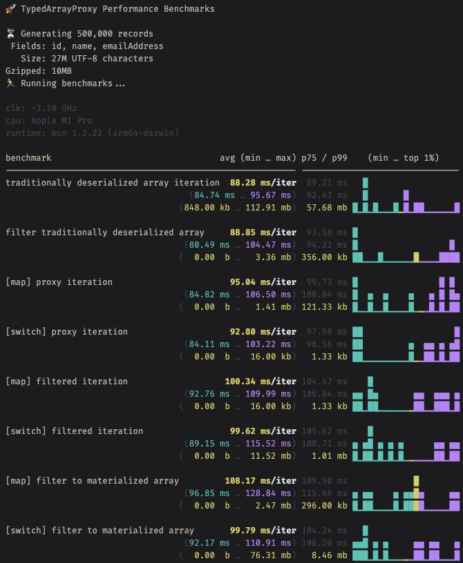

# Typed Array Proxy

A memory-efficient, type-safe proxy for iterating over packed arrays representing objects.

# ☠️☠️ THIS IS A FAILED EXPERIMENT ☠️☠️

While the proxy-based performance over the "packed array" representation of JSON objects
is indeed very fast, the deserialization of the packed array itself is more expensive than
the proxy-based iteration. Therefore, this approach is not recommended.

Additionally, simple measurements confirm that the gzipped size of both representations
is roughly the same, so there is no "wire" benefit to be gained from the packed array.

**FWIW, these observations are definitely true for JavaScriptCore (Safari, Bun).
For v8 (Chrome, Node.js), it's much closer for large arrays, but the differences
for some use cases are so small that the additional complexity is not worth it.**



## Why?

Because of how JavaScript engines represent arrays and objects internally:

### Arrays of arrays

Each inner array is itself a separate object. When deserializing, the engine must allocate a new array object for each nested array, allocate its backing storage, and then populate it. That’s a lot of object creation and pointer chasing.

### Array of objects

A flat array of objects still requires per-object allocation, but the structure is more regular: one top-level array, many sibling objects. Engines can often optimize this layout better (e.g. contiguous storage for the array elements, object shapes reused across objects).

### Cache locality

With nested arrays, data ends up fragmented in memory. Accessing an element requires an extra indirection (outer array → inner array object → element). This hurts CPU cache efficiency. A flat array of objects avoids one level of indirection.

### Hidden classes / shapes

V8 (and other modern engines) can optimize objects with consistent shapes. If every element has the same keys, deserialization can be faster since property storage is predictable. Arrays of arrays don’t benefit as much because the inner arrays are just generic containers.

### Parser overhead

JSON.parse (or similar) must repeatedly enter/exit array contexts for nested arrays, which is slightly more overhead than parsing a flat array of homogenous objects.

## Conclusion

During deserialization:
- **Nested arrays** = more allocations, indirections, and worse memory locality.
- **Flat array of objects** = more predictable, engine-optimized path.

This reality offset any gains made from the proxy-based iteration over arrays of arrays.

----

# Original Content

```typescript
interface UserData extends Record<string, unknown> {
  id: number, name: string, emailAddress: string | null
}

// presume this was received via a `fetch` call or by some other remote means
// this is an alternative way of representing JSON data without repeating the property names
const restResponse: TypedArray<UserData> = {
  fields: ['id', 'name', 'emailAddress'],
  data: [
    [1234, 'David Röhn', null],
    [1235, 'Alex Norquist', 'an@example.com'],
    // thousands, tens of thousands, or even hundreds of thousands of records
  ],
}

const proxy = new TypedArrayProxy(restResponse) // allocates a tiny amount of memory

for (const user of proxy) { // no further allocations while looping
  // process/render immediately - don't store references
  console.log(`rendering: ${user.name} (ID: ${user.id}, Email: ${user.emailAddress})`)
}

const nameQuery = /röh/i
const nameMatcher = (user: UserData) => nameQuery.test(user.name)

for (const user of proxy.filteredIterator(nameMatcher)) { // no further allocations
  // process/render immediately - don't store references
  console.log(`found: ${user.name} (ID: ${user.id}, Email: ${user.emailAddress})`)
}

// allocates only matches in the result array for later use
const matches = proxy.filter(nameMatcher)
console.log('result:', matches)

```
[source](./src/example.ts)

TypedArrayProxy provides an iteration and filtering interface to raw array data (fields + rows)
without creating individual objects for each row. Instead, it uses a single, reusable Proxy
object that dynamically maps property access to the current row's data and iterator generators
to loop without allocation.

## Key Features

- ~~**Memory Efficient**: Uses a single proxy object for all iterations, avoiding object allocation per row~~
  It's not: the deserialization of the packed array itself is more expensive. See details above.
- **Type Safe**: Provides full TypeScript type safety for field access
- **Dual API**: Offers both memory-efficient iteration and convenient materialized methods
- **Repeated Iteration**: Supports multiple iterations over the same dataset
- **Index-based Access**: Allows random access to specific rows via `at(index)` (returns materialized copies)

## Usage Patterns

### ~~Memory-Efficient Iteration~~

```typescript
// removed, because not recommended
// for (const item of proxy) {
//  // Process immediately - don't store references
//  console.log(item.name, item.id);
//}
```

### Materialized Results

```typescript
const allItems = proxy.toArray();             // All items as independent objects
const filtered = proxy.filter(x => x.active); // Filtered items as independent objects
const item = proxy.at(5);                     // Single item as independent object
```

## Performance Characteristics

- **Time**: O(1) field access
- **Space**: ~~O(1) memory overhead regardless of dataset size~~ only true if excluding deserialization
- **Iteration**: Extremely fast due to proxy reuse and minimal allocations

## Important Notes

- Proxy objects from iteration should be used immediately or their data copied
- Materialized methods (toArray, filter) create independent objects safe for storage
- The same proxy instance is reused across all iterations for memory efficiency

## Prerequisites

**Bun**

```bash
curl https://bun.sh/install | bash
```

## Installation

```bash
bun i
```

## Run Demonstration

```bash
bun src/index.ts
```

**with other fixture data**

TODO:

```bash
bun src/index.ts [path to some_fixture_data.json]
```

## Testing

This project includes comprehensive unit tests with > 95% code coverage.

### Run Tests with Coverage

```bash
bun test
```

## Code Quality

```bash
bun quality
```

## Performance Benchmarks

Run comprehensive performance benchmarks comparing different iteration and filtering methods:

```bash
# Run benchmarks with default dataset (20,000 records)
bun run benchmark:small
bun run benchmark:medium
bun run benchmark:large

# Run benchmarks with custom record count
bun --expose-gc src/benchmark/index.ts 50000
```

The benchmark compares:
- **Direct proxy iteration** vs **toArray() then iterate**
- **filteredIterator()** vs **filter()** methods
- Memory usage and execution time across different dataset sizes

Data is generated in-memory using realistic fake data.
Results include detailed timing statistics, memory usage patterns, and visual performance distribution charts.

## Generate More Test Fixture Data

```bash
bun generate-fixtures 1000000 > huge.json
```

## License

MIT
